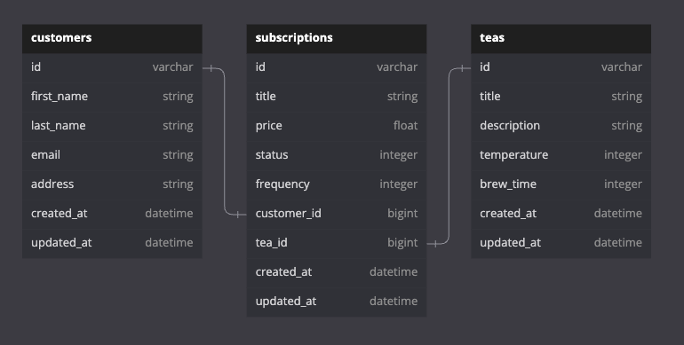

<div align="center">
  <h1>Tea Subscription API</h1>
  
</div>
<br>

A mock API creating a subscription service database to allow customers to order teas of their choice.

<!-- TABLE OF CONTENTS -->
  <details>
  <summary>Table of Contents</summary>
  <ol>
    </li>
    <li><a href="#overview">Overview</a></li>
    <li><a href="#technologies-used">Technologies Used</a></li>
    <li><a href="#schema">Schema</a></li>
    <li><a href="#local-setup">Local Setup</a></li>
    <li><a href="#api-endpoints">API Endpoints</a></li>
    <li><a href="#postman-collection">Postman Collection</a></li>
  </ol>
</details>

<!-- OVERVIEW -->
## Overview

  This project is designed as a final assessment for [Turing School of Software and Design](https://turing.edu/) Backend program. The objective is to create a RESTful API that allows a customer to subscribe to a tea selection, update the parameters of their subscription, cancel subscriptions, and to show an index of a customer's subscriptions.

  For full understanding of the project and requirements, please check out this link: [Tea Subscription API Take-Home Challenge](https://mod4.turing.edu/projects/take_home/take_home_be)

<p align="right">(<a href="#top">back to top</a>)</p>

<!-- TECHNOLOGIES USED -->
## Technologies Used

[](https://www.ruby-lang.org/en/) *2.7.4*
[](https://rubyonrails.org/) *5.2.8*

[](https://www.postman.com/product/what-is-postman/)<br>

<p align="right">(<a href="#top">back to top</a>)</p>

<!-- SCHEMA -->
## Schema


<p align="right">(<a href="#top">back to top</a>)</p>

<!-- LOCAL SETUP -->
## Local Setup

1. Clone this repository on your local machine.

2. Install required Gems utilizing Bundler: <br>
- In terminal, use Bundler to install any missing Gems. If Bundler is not installed, first run the following command.
```shell
$ gem install bundler
```

- If Bundler is already installed or after it has been installed, run the following command.
```shell
$ bundle install
```

3. Database Migration<br>
- Before using the web application you will need to setup your databases locally by running the following command
```shell
$ rails db:{drop,create,migrate,seed}
```

4. Check API endpoints<br>
- To test and run the endpoints, begin by starting a local server by running the following command
```shell
$ rails s
```
- Then, using a browser or Postman, the endpoint can be reached via `localhost:3000` with the full url path that looks like the following
```shell
http://localhost:3000
```

<p align="right">(<a href="#top">back to top</a>)</p>

<!-- API ENDPOINTS -->
## API Endpoints

### GET List of all of a Customer's Subscriptions

`GET /api/v1/customers/:customer_id/subscriptions`

**Example JSON Response Body**
```shell
{
    "data": [
        {
            "id": "1",
            "type": "subscription",
            "attributes": {
                "title": "Earl Grey Monthly",
                "price": 39.99,
                "status": "active",
                "frequency": "monthly",
                "customer_id": 1,
                "tea_id": 1
            }
        },
        {
            "id": "2",
            "type": "subscription",
            "attributes": {
                "title": "Black Monthly",
                "price": 39.99,
                "status": "active",
                "frequency": "monthly",
                "customer_id": 1,
                "tea_id": 2
            }
        }
    ]
}
```

### POST a new Subscription

`POST /api/v1/customers/:customer_id/subscriptions`

**Example JSON Request Body**
```shell
{
    "title" : "Black Weekly",
    "price" : 19.99,
    "tea_id" : 2
}
```
*NOTE* - `:status` and `:frequency` contain default values of `"active"` and `"weekly"`, respectively. Frequency currently allows for three values: `"weekly", "monthly", and "quarterly"`. These parameters can be specified when creating a subscription and would look like the following:
```shell
{
    "title" : "Black Monthly",
    "price" : 39.99,
    "tea_id" : 2,
    "frequency": "monthly"
}
```

**Example JSON Response Body**
```shell
{
    "data": {
        "id": "2",
        "type": "subscription",
        "attributes": {
            "title": "Black Weekly",
            "price": 19.99,
            "status": "active",
            "frequency": "weekly",
            "customer_id": 1,
            "tea_id": 2
        }
    }
}
```


### PATCH a Subscription

`PATCH /api/v1/customers/:customer_id/subscriptions/:subscription_id`

To represent the changes, we will use the example response from the last POST request, as shown above.<br>
**Example JSON Request Body**
```shell
{
    "title" : "Black Monthly",
    "price" : 39.99,
    "frequency": "monthly",
    "subscription_id": 2
}
```
*NOTE* - `:subscription_id` is a required field within the request body. This method is also used to update the status of an existing subscription and would look as follows:
```shell
{
    "subscription_id": 2,
    "status": "cancelled"
}
```

**Example JSON Response Body**
* Updated parameters:
```shell
{
    "data": {
        "id": "2",
        "type": "subscription",
        "attributes": {
            "title": "Black Monthly",
            "price": 39.99,
            "status": "active",
            "frequency": "monthly",
            "customer_id": 1,
            "tea_id": 2
        }
    }
}
```
* Updated status:
```shell
{
    "data": {
        "id": "2",
        "type": "subscription",
        "attributes": {
            "title": "Black Weekly",
            "price": 19.99,
            "status": "cancelled",
            "frequency": "weekly",
            "customer_id": 1,
            "tea_id": 2
        }
    }
}
```

### Sad Path/Errors
If params are missing in the create subscription request body, the response will return an error.  For example, if price is not sent:<br>
```ruby
    "error": "Price can't be blank"
```
If updating or cancelling a subscription without a valid subscription ID:<br>
```ruby
    "error": "Invalid Subscription ID"
```
If updating a subscription with missing parameters, such as frequency:<br>
```ruby
    "error": "Frequency can't be blank"
```
If getting all subscriptions for a customer without a valid customer ID:<br>
```ruby
    "error": "Customer ID does not exist."
```
If the customer's ID is valid but they do not yet have any subscriptions:<br>
```ruby
    "message": "Customer has no subscriptions."
```

<p align="right">(<a href="#top">back to top</a>)</p>

<!-- POSTMAN COLLECTION -->
## Postman Collection
An example Postman collection demonstrating the above endpoints:<br>
[Tea Subscriptions API Postman Collection](https://www.getpostman.com/collections/d625681b05b0af22ca52)

<p align="right">(<a href="#top">back to top</a>)</p>
